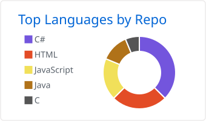
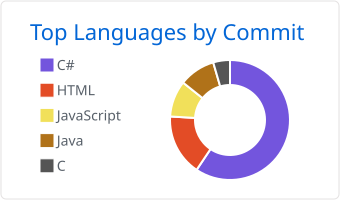
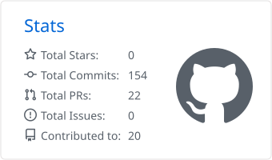
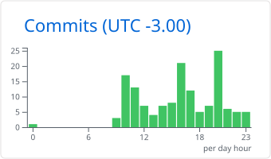

<h1 align="center">Igor Xavier</h1>

  Desenvolvedor em formação | Análise e Desenvolvimento de Sistemas (IFSP) 
  Foco em Desenvolvimento Back-end e Full Stack

  <a href="https://www.linkedin.com/in/i-xavier/">LinkedIn</a> &nbsp;|&nbsp;
  <a href="mailto:igorxavier.49@gmail.com">E-mail</a> &nbsp;|&nbsp;
  <a href="https://github.com/i-xavier?tab=repositories">Repositórios</a>

---

## Sobre

Estudante de Análise e Desenvolvimento de Sistemas no IFSP, com experiência acadêmica em **C#**, **C ANSI**, **SQL** e **MySQL**. Trabalho com Programação Orientada a Objetos, modelagem de bancos de dados relacionais, levantamento de requisitos e testes funcionais, sempre com versionamento em Git e GitHub.

Atualmente aprofundo meus conhecimentos em desenvolvimento web pelo **Full Stack Open** (University of Helsinki), construindo aplicações full stack com JavaScript, React e Node.js.

---

## Tecnologias

**Experiência**

**Em aprendizado**

**Conceitos:** Programação Orientada a Objetos, Estruturas de Dados, Modelagem Relacional, Normalização, Integridade Referencial, Levantamento de Requisitos e Testes Funcionais.

---

## Estatísticas do GitHub

<table>
  <tr>
    <td width="50%" valign="top">
      <picture>
        <source media="(prefers-color-scheme: dark)" srcset="./profile-summary-card-output/github_dark/1-repos-per-language.svg" />
        
      </picture>
    </td>
    <td width="50%" valign="top">
      <picture>
        <source media="(prefers-color-scheme: dark)" srcset="./profile-summary-card-output/github_dark/2-most-commit-language.svg" />
        
      </picture>
    </td>
  </tr>
  <tr>
    <td width="50%" valign="top">
      <picture>
        <source media="(prefers-color-scheme: dark)" srcset="./profile-summary-card-output/github_dark/3-stats.svg" />
        
      </picture>
    </td>
    <td width="50%" valign="top">
      <picture>
        <source media="(prefers-color-scheme: dark)" srcset="./profile-summary-card-output/github_dark/4-productive-time.svg" />
        
      </picture>
    </td>
  </tr>
</table>

Cards gerados automaticamente via GitHub Actions a cada 24 horas. Os percentuais de linguagem refletem o volume de código versionado, não o nível de domínio em cada tecnologia.

---

## Projetos em destaque

### [Luck Games](https://github.com/i-xavier/projeto-integrador-luck-games)

Aplicação desktop para gerenciamento de ordens de serviço, desenvolvida em C#. O projeto abrangeu levantamento de requisitos, modelagem do banco de dados, implementação da lógica de negócio e testes funcionais.

`C#` `SQL` `MySQL` `Git`

### [Loja de Materiais de Construção](https://github.com/i-xavier/projeto-loja-materiais-construcao)

Modelagem completa de um banco de dados relacional, com modelos conceitual, lógico e físico, dicionário de dados, normalização até a 3FN e integridade referencial.

`MySQL` `SQL` `Modelagem Relacional`

### [Mickey & Donald](https://github.com/i-xavier/sistema-simulador-drive-thru)

Sistema de gerenciamento de pedidos via linha de comando, desenvolvido em C ANSI, com persistência em arquivos binários e aplicação de estruturas de dados.

`C ANSI` `Arquivos Binários` `CLI`

---

## Em andamento

**Full Stack Open, University of Helsinki**

JavaScript, React, Node.js, APIs REST, testes automatizados, bancos de dados e desenvolvimento de aplicações web full stack.

---

## Formação

| Curso | Instituição | Situação |
| --- | --- | --- |
| Análise e Desenvolvimento de Sistemas | IFSP | Cursando (previsão de conclusão: 12/2027) |
| Técnico em Multimídia | ETEC Jornalista Roberto Marinho | Concluído |
| Programador de Sistemas | Senac / Transforme-se (Serasa Experian) | Concluído |
| Lógica de Programação | Senac / Transforme-se (Serasa Experian) | Concluído |
